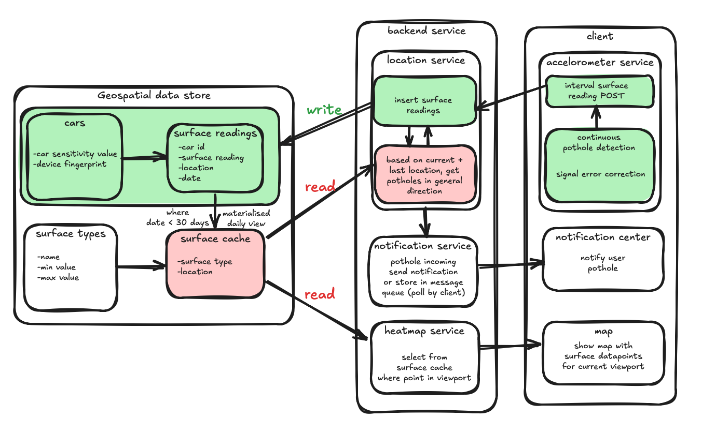

### BREAKPOINT

Breakpoint is a system that passively detects potholes and assesses road quality using a smartphone’s built-in accelerometer. As users drive, it analyzes vibrations to classify road segments by surface condition—ranging from smooth asphalt to rough gravel—and automatically identifies potholes based on sudden spikes.
The collected data is visualized in a color-coded web-based heatmap, showing real-world road quality across the area. This provides both drivers and infrastructure services with a clear overview of problematic segments and rough zones.
Breakpoint also serves as a scalable infrastructure tool. All collected data is stored for further analysis and can be integrated into existing navigation apps or shared with road maintenance services to support smarter repair planning.
Breakpoint combines real-time driver protection with scalable, crowd-powered infrastructure insights. It’s lightweight, frictionless, and already working—turning every phone into a road quality sensor, and every trip into actionable data.